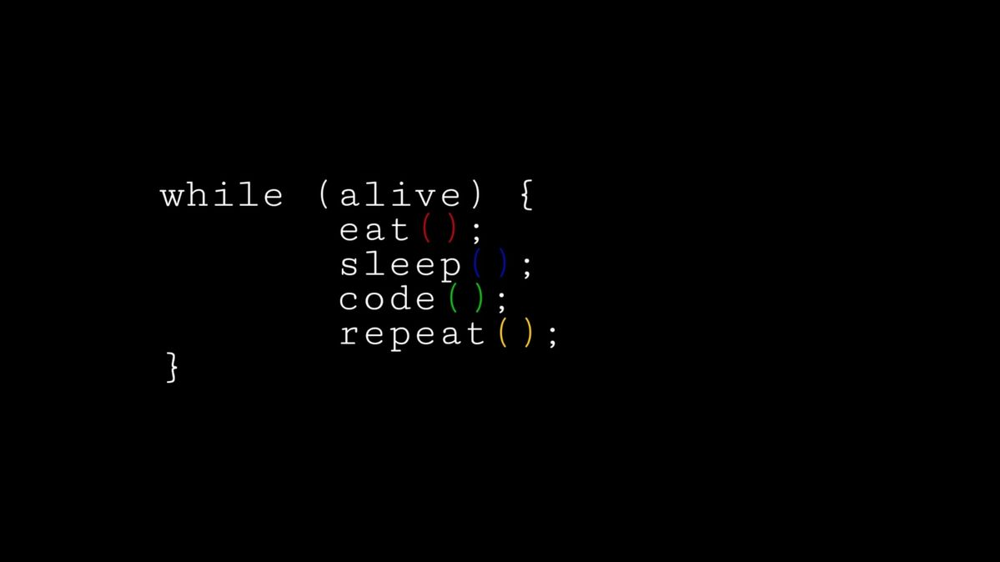

# 👋 Hey, I'm Nitu Bagchi  

━━━━━━━━━━━━━━━━━━━━━━━━━━━━━━━━━━
## 🚀 What I Do  
💡 AI Tools Development  
🛠 Full-Stack Web Development  
📱 App Development (React Native)  
🎨 UI/UX Design  
🎮 Game Development      
🧠 Automation Scripts  

━━━━━━━━━━━━━━━━━━━━━━━━━━━━━━━━━━

## 🛠️ Tech Stack  

 
 
━━━━━━━━━━━━━━━━━━━━━━━━━━━━━━━━━━

## 🧰 Tools I Use Everyday  
🖥 VS Code  
🌐 Chrome DevTools  
📦 Node.js  
🎨 Figma  
🐳 Docker  
🔥 Firebase  
━━━━━━━━━━━━━━━━━━━━━━━━━━━━━━━━━━

━━━━━━━━━━━━━━━━━━━━━━━━━━━━━━━━━━
## 🌐 Connect With Me  

━━━━━━━━━━━━━━━━━━━━━━━━━━━━━━━━━━

# 📊 GitHub Stats:
 
 

## 🏆 GitHub Trophies

### 🔝 Top Contributed Repo

---

━━━━━━━━━━━━━━━━━━━━━━━━━━━━━━━━━━                

<!--
**nitubg/nitubg** is a ✨ _special_ ✨ repository because its `README.md` (this file) appears on your GitHub profile.

Here are some ideas to get you started:

- 🔭 I’m currently working on ...
- 🌱 I’m currently learning ...
- 👯 I’m looking to collaborate on ...
- 🤔 I’m looking for help with ...
- 💬 Ask me about ...
- 📫 How to reach me: ...
- 😄 Pronouns: ...
- ⚡ Fun fact: ...
 

<---
-->
